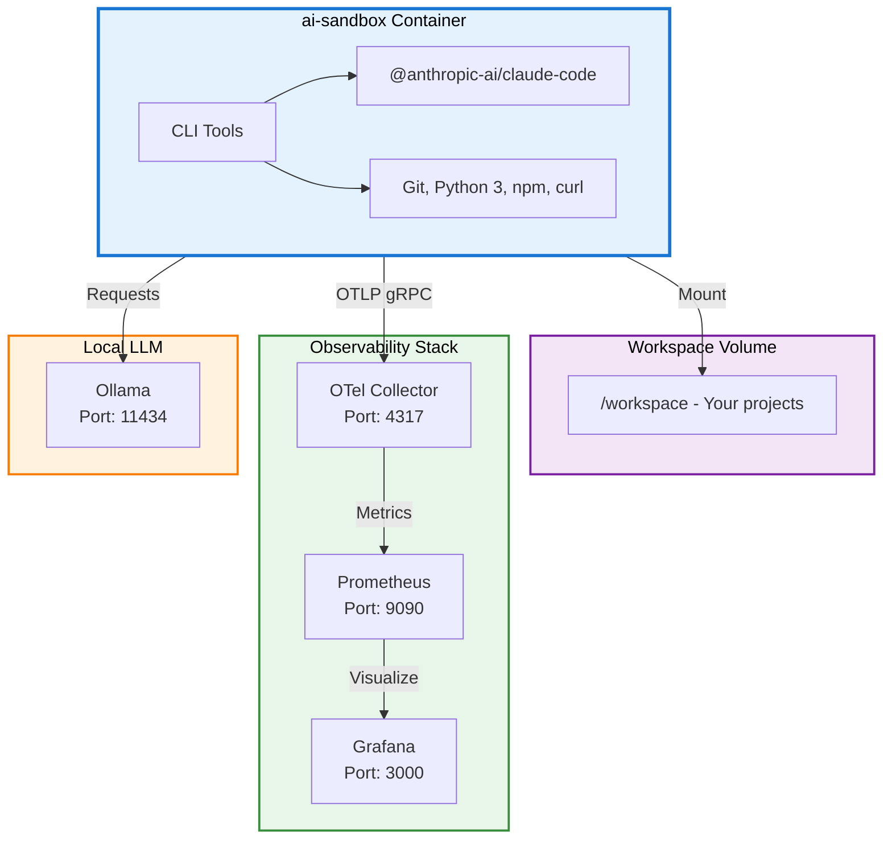

# Developer Guide - AI Sandbox

This detailed guide covers the architecture, advanced configuration, and use cases for ai-sandbox.

## MCP Configuration (Model Context Protocol)

The Model Context Protocol (MCP) extends Claude's capabilities with external tools like GitHub.

### GitHub Configuration for Claude

**Official documentation**: See the [official installation guide](https://github.com/github/github-mcp-server/blob/main/docs/installation-guides/install-claude.md) for more details, including creating a [GitHub Token](https://github.com/github/github-mcp-server/blob/main/docs/installation-guides/install-claude.md#creating-a-github-token).

1. **Create the AI CLI data folder** (first time only):
   ```bash
   mkdir -p ai-cli-data
   ```

2. **Launch the environment**:
   ```bash
   docker-compose up -d
   docker exec -it ai-sandbox bash
   ```

3. **Install the GitHub MCP** (inside the container):
   ```bash
   claude mcp add --transport http github \
     "https://api.githubcopilot.com/mcp" \
     -H "Authorization: Bearer $GITHUB_TOKEN"
   ```

4. **Verification**:
   The configuration will be automatically saved in `ai-cli-data/.claude.json` and persisted between sessions.

**Security**: The `ai-cli-data` folder is automatically ignored by Git to avoid pushing secrets.

### Per-project Configuration

The GitHub MCP is configured by default for the `/workspace` root folder. If you launch Claude from another folder within `workspace` (e.g., `/workspace/projects/my-project`), you need to manually add the configuration to the `.claude.json` file.

1. **Open the file** `ai-cli-data/.claude.json`
2. **Add a section** in `"projects"` by copying the `/workspace` configuration and replacing the path:

   ```json
   "/workspace/projects/my-project": {
     "allowedTools": [],
     "mcpContextUris": [],
     "mcpServers": {
       "github": {
         "type": "http",
         "url": "https://api.githubcopilot.com/mcp",
         "headers": {
           "Authorization": "Bearer $GITHUB_TOKEN"
         }
       }
     },
     "enabledMcpjsonServers": [],
     "disabledMcpjsonServers": [],
     "hasTrustDialogAccepted": false,
     "projectOnboardingSeenCount": 0,
     "hasClaudeMdExternalIncludesApproved": false,
     "hasClaudeMdExternalIncludesWarningShown": false
   }
   ```

3. **Replace** `$GITHUB_TOKEN` with your actual GitHub token.

**Tip**: The `GITHUB_TOKEN` is stored in the `.env` file in the `SANDBOX_SECRETS_DIR` folder. This folder must be kept **outside** any repository where an AI coding assistant runs, to prevent accidental exposure of API keys.

**Note**: Repeat this step for each new project where you want to use the GitHub MCP.

### Context7 Configuration for Claude

**Official configuration**: Context7 is available via HTTP and requires an API key for authentication.

1. **Launch the environment** (if not already running):
   ```bash
   docker-compose up -d
   docker exec -it ai-sandbox bash
   ```

2. **Install the Context7 MCP** (inside the container):
   ```bash
   claude mcp add --transport http context7 \
     "https://mcp.context7.com/mcp" \
     --header "CONTEXT7_API_KEY: ${CONTEXT7_TOKEN}"
   ```

3. **Verification**:
   The configuration will be automatically saved in `ai-cli-data/.claude.json` and persisted between sessions.

**Tip**: The `CONTEXT7_TOKEN` is stored in the `.env` file in the `SANDBOX_SECRETS_DIR` folder. Make sure to load this file before running the commands:
   ```bash
   source /path/to/SANDBOX_SECRETS_DIR/.env
   ```

**Security**: Make sure the `CONTEXT7_TOKEN` environment variable is set before running the command.

## Observability in Detail

The full observability stack is pre-configured:

### OpenTelemetry Collector
- **Port**: 4317 (OTLP gRPC)
- **Role**: Centralized metrics and traces collection
- **Configuration**: [observability/otel-collector-config.yaml](observability/otel-collector-config.yaml)
- Exports metrics to Prometheus on port `9464`

### Prometheus
- **Port**: 9090
- **Role**: Metrics storage and querying
- **Scrape interval**: 15s
- **Configuration**: [observability/prometheus.yml](observability/prometheus.yml)
- Access: http://localhost:9090

### Grafana
- **Port**: 3000
- **Role**: Metrics visualization and dashboards
- **Default credentials**: admin / admin (change in production)
- Persistent volume: `grafana-data:/var/lib/grafana`

### Telemetry

Telemetry can be configured by editing `docker-compose.yml`:

```yaml
environment:
  - CLAUDE_CODE_ENABLE_TELEMETRY=1
  - OTEL_METRICS_EXPORTER=otlp
  - OTEL_EXPORTER_OTLP_ENDPOINT=http://otel-collector:4317
```

### Testing Telemetry

To verify the observability stack is working correctly:

1. **Restart the services**:
   ```bash
   docker-compose down
   docker-compose up -d
   ```

2. **Open a shell in the `ai-sandbox` container**:
   ```bash
   docker exec -it ai-sandbox bash
   cd /workspace
   ```

3. **Verify the collector is receiving data**:
   ```bash
   docker logs otel-collector --tail=50
   ```

4. **Check Prometheus** (http://localhost:9090) to see collected metrics.

5. **Check Grafana** (http://localhost:3000) to visualize the metrics.

## Architecture



## Detailed Configuration

### Environment Variables

In `docker-compose.yml`, you can configure:

| Variable | Description | Example |
|----------|-------------|---------|
| `OLLAMA_HOST` | Ollama server URL | `http://ollama:11434` |
| `CLAUDE_CODE_ENABLE_TELEMETRY` | Enable Claude telemetry | `1` |
| `OTEL_EXPORTER_OTLP_ENDPOINT` | OpenTelemetry endpoint | `http://otel-collector:4317` |

### Volumes and Persistence

| Volume | Mount Point | Description |
|--------|-------------|-------------|
| `ollama` | `/root/.ollama` | Ollama model cache |
| `grafana-data` | `/var/lib/grafana` | Persistent Grafana data |
| `workspace` (bind) | `/workspace` | Your projects and data |

### Exposed Ports

| Service | Port | Access |
|---------|------|--------|
| Grafana | 3000 | http://localhost:3000 |
| Prometheus | 9090 | http://localhost:9090 |
| Ollama | 11434 | http://localhost:11434 |
| OTel Collector gRPC | 4317 | Internal |
| OTel Metrics | 9464 | Internal |

## Advanced Use Cases

### Experimenting with Claude

```bash
docker exec -it ai-sandbox bash
claude --help
```

### Monitoring Your Experiments

1. **Enable telemetry** in docker-compose.yml
2. **Access Grafana**: http://localhost:3000
3. **Configure Prometheus** as datasource (http://otel-collector:9464)
4. **Create custom dashboards**

### Letting Claude Code Push Autonomously

To let Claude Code create branches, commit, and push on its own, you need to configure git credentials inside the container.

#### 1. Generate a GitHub Personal Access Token

Create a [fine-grained token](https://github.com/settings/tokens?type=beta) with **Contents** (read/write) permission on the repos you want Claude to push to.

Add it to your secrets `.env` file on your `SANDBOX_SECRETS_DIR`:

```dotenv
GITHUB_TOKEN=ghp_xxxxxxxxxxxx
```

#### 2. Configure git inside the container

Once inside the container, set up your identity and credential helper:

```bash
git config --global user.name "Gireg Roussel"
git config --global user.email "giregroussel@free.fr"
git config --global url."https://${GITHUB_TOKEN}@github.com/".insteadOf "https://github.com/"
```

> You can add these commands to a startup script to avoid repeating them each session.

#### 3. Give Claude Code the right permissions

Launch Claude Code in the project directory:

```bash
cd /path/to/your/project
claude
```

Then ask Claude to work autonomously, for example:

```
> Refactor the auth module, then create a branch, commit, and push a PR.
```

Claude Code will be able to run `git checkout -b`, `git commit`, `git push`, and `gh pr create` on its own.

### Using Ollama for Local Models

```bash
# From the ai-sandbox container
docker exec -it ai-sandbox bash

# List available models
curl http://ollama:11434/api/tags

# Use a model (example: mistral)
ollama run mistral
```

## Security

- **Non-root user**: The image uses an `aiuser` user for security
- **Ignored secrets**: The `secrets/` and `ai-cli-data/` folders are ignored by Git
- **Dedicated volumes**: Sensitive data is stored in volumes, not in the code
- **Credentials**: Grafana uses default credentials in dev (secure in production)

## Troubleshooting

### Services won't start

```bash
# Check container status
docker-compose ps

# View the logs
docker-compose logs -f

# Restart the services
docker-compose restart
```

### Grafana connection fails

```bash
# Verify the container is running
docker-compose ps grafana

# Check the logs
docker-compose logs grafana

# Reset Grafana data
docker-compose down
docker volume rm ai-docker_grafana-data
docker-compose up -d
```

## External Resources

- [Docker Documentation](https://docs.docker.com/)
- [OpenTelemetry](https://opentelemetry.io/)
- [Grafana](https://grafana.com/grafana/)
- [Prometheus](https://prometheus.io/)
- [Ollama](https://ollama.ai/)
- [Anthropic Claude](https://www.anthropic.com/)

---

**Need help?** See the [README](README.md) for quick setup or [CONTRIBUTING](CONTRIBUTING.md) to contribute to the project.
