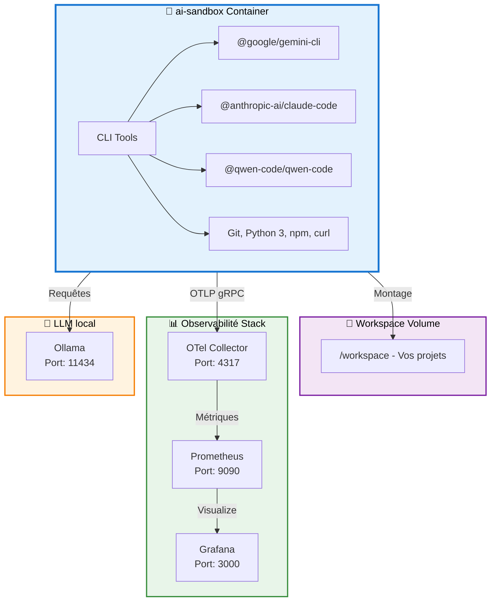

git # Developer Guide - AI Docker Sandbox

Ce guide détaillé couvre l'architecture, la configuration avancée et les cas d'usage de ai-docker.

## 🔧 Configuration MCP (Model Context Protocol)

Le Model Context Protocol (MCP) permet d'étendre les capacités de Claude avec des outils externes comme GitHub.

### Configuration GitHub pour Claude

**📖 Documentation officielle** : Consultez le [guide d'installation officiel](https://github.com/github/github-mcp-server/blob/main/docs/installation-guides/install-claude.md) pour plus de détails, incluant la création d'un [GitHub Token](https://github.com/github/github-mcp-server/blob/main/docs/installation-guides/install-claude.md#creating-a-github-token).

1. **Créer le dossier de données Claude** (première fois uniquement) :
   ```bash
   mkdir -p claude-code-data
   ```

2. **Lancer l'environnement** :
   ```bash
   docker-compose up -d
   docker exec -it ai-sandbox bash
   ```

3. **Installer le MCP GitHub** (dans le conteneur) :
   ```bash
   claude mcp add --transport http github \
     "https://api.githubcopilot.com/mcp" \
     -H "Authorization: Bearer $GITHUB_TOKEN"
   ```

4. **Vérification** :
   La configuration sera automatiquement sauvegardée dans `claude-code-data/.claude.json` et persistée entre les sessions.

**🔒 Sécurité** : Le dossier `claude-code-data` est automatiquement ignoré par Git pour éviter de pousser des secrets.

### Configuration par projet

Le MCP GitHub est configuré par défaut pour le dossier racine `/workspace`. Si vous lancez Claude depuis un autre dossier dans `workspace` (par exemple `/workspace/projects/mon-projet`), vous devez ajouter manuellement la configuration dans le fichier `.claude.json`.

1. **Ouvrez le fichier** `claude-code-data/.claude.json`
2. **Ajoutez une section** dans `"projects"` en copiant la configuration de `/workspace` et en remplaçant le chemin :

   ```json
   "/workspace/projects/mon-projet": {
     "allowedTools": [],
     "mcpContextUris": [],
     "mcpServers": {
       "github": {
         "type": "http",
         "url": "https://api.githubcopilot.com/mcp",
         "headers": {
           "Authorization": "Bearer $GITHUB_TOKEN"
         }
       }
     },
     "enabledMcpjsonServers": [],
     "disabledMcpjsonServers": [],
     "hasTrustDialogAccepted": false,
     "projectOnboardingSeenCount": 0,
     "hasClaudeMdExternalIncludesApproved": false,
     "hasClaudeMdExternalIncludesWarningShown": false
   }
   ```

3. **Remplacez** `$GITHUB_TOKEN` par votre token GitHub réel.

**💡 Note** : Répétez cette étape pour chaque nouveau projet où vous souhaitez utiliser le MCP GitHub.

## 📊 Observabilité en détail

La stack complète d'observabilité est pré-configurée :

### OpenTelemetry Collector
- **Port** : 4317 (OTLP gRPC)
- **Rôle** : Collecte centralisée des métriques et traces
- **Configuration** : [observability/otel-collector-config.yaml](observability/otel-collector-config.yaml)
- Exporte les métriques vers Prometheus sur le port `9464`

### Prometheus
- **Port** : 9090
- **Rôle** : Stockage et requêtes des métriques
- **Scrape interval** : 15s
- **Configuration** : [observability/prometheus.yml](observability/prometheus.yml)
- Accès : http://localhost:9090

### Grafana
- **Port** : 3000
- **Rôle** : Visualisation et dashboards des métriques
- **Credentials par défaut** : admin / admin (à changer en production)
- Volume persistant : `grafana-data:/var/lib/grafana`

### Télémétrie Gemini

La télémétrie Gemini est actuellement **désactivée par défaut** mais peut être activée en éditant `docker-compose.yml` :

```yaml
environment:
  - GEMINI_TELEMETRY_ENABLED=true
  - GEMINI_TELEMETRY_TARGET=local
  - GEMINI_TELEMETRY_USE_COLLECTOR=true
  - GEMINI_TELEMETRY_OTLP_ENDPOINT=http://otel-collector:4317
```

## 🏗️ Architecture détaillée



## 🛠️ Configuration détaillée

### Variables d'environnement

Dans `docker-compose.yml`, vous pouvez configurer :

| Variable | Description | Exemple |
|----------|-------------|---------|
| `OLLAMA_HOST` | URL du serveur Ollama | `http://ollama:11434` |
| `GEMINI_TELEMETRY_ENABLED` | Active la télémétrie Gemini | `true/false` |
| `GEMINI_TELEMETRY_TARGET` | Cible télémétrie Gemini | `local` |
| `GEMINI_TELEMETRY_OTLP_ENDPOINT` | Endpoint OpenTelemetry | `http://otel-collector:4317` |

### Volumes et persistance

| Volume | Point de montage | Description |
|--------|------------------|-------------|
| `ollama` | `/root/.ollama` | Cache des modèles Ollama |
| `grafana-data` | `/var/lib/grafana` | Données Grafana persistantes |
| `workspace` (bind) | `/workspace` | Vos projets et données |

### Ports exposés

| Service | Port | Accès |
|---------|------|-------|
| Grafana | 3000 | http://localhost:3000 |
| Prometheus | 9090 | http://localhost:9090 |
| Ollama | 11434 | http://localhost:11434 |
| OTel Collector gRPC | 4317 | Interne |
| OTel Metrics | 9464 | Interne |

## 📚 Cas d'usage avancés

### Expérimenter avec Gemini

```bash
docker exec -it ai-sandbox bash
gemini --help
# Authentification et utilisation
```

### Expérimenter avec Claude

```bash
docker exec -it ai-sandbox bash
claude-code --help
# Utilisation des outils Claude
```

### Expérimenter avec Qwen

```bash
docker exec -it ai-sandbox bash
qwen-code --help
# Utilisation des outils Qwen
```

### Monitorer vos expériences

1. **Activer la télémétrie** dans docker-compose.yml
2. **Accéder à Grafana** : http://localhost:3000
3. **Configurer Prometheus** comme datasource (http://otel-collector:9464)
4. **Créer des dashboards** personnalisés

### Utiliser Ollama pour les modèles locaux

```bash
# Depuis le conteneur ai-sandbox
docker exec -it ai-sandbox bash

# Lister les modèles disponibles
curl http://ollama:11434/api/tags

# Utiliser un modèle (exemple: mistral)
ollama run mistral
```

## 🔒 Sécurité

- **Utilisateur non-root** : L'image utilise un utilisateur `aiuser` pour des raisons de sécurité
- **Secrets ignorés** : Les dossiers `secrets/` et `claude-code-data/` sont ignorés par Git
- **Volumes dédiés** : Les données sensibles sont stockées dans des volumes, pas dans le code
- **Credentials** : Grafana utilise les credentials par défaut en dev (à sécuriser en production)

## 🐛 Troubleshooting

### Les services ne se lancent pas

```bash
# Vérifier l'état des conteneurs
docker-compose ps

# Consulter les logs
docker-compose logs -f

# Redémarrer les services
docker-compose restart
```

### Volumes ne se montent pas correctement (Colima)

```bash
# Redémarrer Colima
colima stop
colima start

# Relancer les conteneurs
docker-compose restart
```

### Pas assez de ressources (Colima)

```bash
# Éditer la configuration
colima edit

# Augmenter cpu, memory, disk
# Exemple:
# cpu: 4
# memory: 8
# disk: 100

# Appliquer les changements
colima restart
```

### Connexion à Grafana échoue

```bash
# Vérifier que le conteneur est lancé
docker-compose ps grafana

# Vérifier les logs
docker-compose logs grafana

# Réinitialiser les données Grafana
docker-compose down
docker volume rm ai-docker_grafana-data
docker-compose up -d
```

## 📖 Fichiers de configuration

### Dockerfile

Définit l'image `ai-sandbox` avec :
- Node.js 20
- CLIs Gemini, Claude, Qwen
- Python 3, Git, curl
- Utilisateur non-root pour la sécurité

### docker-compose.yml

Orchestre les services :
- `ai-sandbox` : Conteneur principal
- `ollama` : LLMs locaux
- `otel-collector` : Collecte de métriques
- `prometheus` : Stockage des métriques
- `grafana` : Visualisation

### observability/otel-collector-config.yaml

Configuration du collecteur OpenTelemetry :
- Récepteur OTLP gRPC sur le port 4317
- Exportateur Prometheus sur le port 9464
- Pipeline de métriques

### observability/prometheus.yml

Configuration de Prometheus :
- Scrape interval : 15 secondes
- Scrape du collecteur OpenTelemetry

## 📚 Ressources externes

- [Docker Documentation](https://docs.docker.com/)
- [OpenTelemetry](https://opentelemetry.io/)
- [Grafana](https://grafana.com/grafana/)
- [Prometheus](https://prometheus.io/)
- [Ollama](https://ollama.ai/)
- [Google Gemini CLI](https://github.com/google/gemini-cli)
- [Anthropic Claude](https://www.anthropic.com/)
- [Alibaba Qwen](https://qwenlm.github.io/)

---

**Besoin d'aide ?** Consultez le [README](README.md) pour la configuration rapide ou le [CONTRIBUTING](CONTRIBUTING.md) pour contribuer au projet.

# Developer Guide - AI Docker Sandbox

Ce guide détaillé couvre l'architecture, la configuration avancée et les cas d'usage de ai-docker.

## 🔧 Configuration MCP (Model Context Protocol)

Le Model Context Protocol (MCP) permet d'étendre les capacités de Claude avec des outils externes comme GitHub.

### Configuration GitHub pour Claude

**📖 Documentation officielle** : Consultez le [guide d'installation officiel](https://github.com/github/github-mcp-server/blob/main/docs/installation-guides/install-claude.md) pour plus de détails, incluant la création d'un [GitHub Token](https://github.com/github/github-mcp-server/blob/main/docs/installation-guides/install-claude.md#creating-a-github-token).

1. **Créer le dossier de données Claude** (première fois uniquement) :
   ```bash
   mkdir -p claude-code-data
   ```

2. **Lancer l'environnement** :
   ```bash
   docker-compose up -d
   docker exec -it ai-sandbox bash
   ```

3. **Installer le MCP GitHub** (dans le conteneur) :
   ```bash
   claude mcp add --transport http github \
     "https://api.githubcopilot.com/mcp" \
     -H "Authorization: Bearer $GITHUB_TOKEN"
   ```

4. **Vérification** :
   La configuration sera automatiquement sauvegardée dans `claude-code-data/.claude.json` et persistée entre les sessions.

**🔒 Sécurité** : Le dossier `claude-code-data` est automatiquement ignoré par Git pour éviter de pousser des secrets.

### Configuration par projet

Le MCP GitHub est configuré par défaut pour le dossier racine `/workspace`. Si vous lancez Claude depuis un autre dossier dans `workspace` (par exemple `/workspace/projects/mon-projet`), vous devez ajouter manuellement la configuration dans le fichier `.claude.json`.

1. **Ouvrez le fichier** `claude-code-data/.claude.json`
2. **Ajoutez une section** dans `"projects"` en copiant la configuration de `/workspace` et en remplaçant le chemin :

   ```json
   "/workspace/projects/mon-projet": {
     "allowedTools": [],
     "mcpContextUris": [],
     "mcpServers": {
       "github": {
         "type": "http",
         "url": "https://api.githubcopilot.com/mcp",
         "headers": {
           "Authorization": "Bearer $GITHUB_TOKEN"
         }
       }
     },
     "enabledMcpjsonServers": [],
     "disabledMcpjsonServers": [],
     "hasTrustDialogAccepted": false,
     "projectOnboardingSeenCount": 0,
     "hasClaudeMdExternalIncludesApproved": false,
     "hasClaudeMdExternalIncludesWarningShown": false
   }
   ```

3. **Remplacez** `$GITHUB_TOKEN` par votre token GitHub réel.

**💡 Note** : Répétez cette étape pour chaque nouveau projet où vous souhaitez utiliser le MCP GitHub.

## 📊 Observabilité en détail

La stack complète d'observabilité est pré-configurée :

### OpenTelemetry Collector
- **Port** : 4317 (OTLP gRPC)
- **Rôle** : Collecte centralisée des métriques et traces
- **Configuration** : [observability/otel-collector-config.yaml](observability/otel-collector-config.yaml)
- Exporte les métriques vers Prometheus sur le port `9464`

### Prometheus
- **Port** : 9090
- **Rôle** : Stockage et requêtes des métriques
- **Scrape interval** : 15s
- **Configuration** : [observability/prometheus.yml](observability/prometheus.yml)
- Accès : http://localhost:9090

### Grafana
- **Port** : 3000
- **Rôle** : Visualisation et dashboards des métriques
- **Credentials par défaut** : admin / admin (à changer en production)
- Volume persistant : `grafana-data:/var/lib/grafana`

### Télémétrie Gemini

La télémétrie Gemini est actuellement **désactivée par défaut** mais peut être activée en éditant `docker-compose.yml` :

```yaml
environment:
  - GEMINI_TELEMETRY_ENABLED=true
  - GEMINI_TELEMETRY_TARGET=local
  - GEMINI_TELEMETRY_USE_COLLECTOR=true
  - GEMINI_TELEMETRY_OTLP_ENDPOINT=http://otel-collector:4317
```

## 🏗️ Architecture détaillée


## 🛠️ Configuration détaillée

### Variables d'environnement

Dans `docker-compose.yml`, vous pouvez configurer :

| Variable | Description | Exemple |
|----------|-------------|---------|
| `OLLAMA_HOST` | URL du serveur Ollama | `http://ollama:11434` |
| `GEMINI_TELEMETRY_ENABLED` | Active la télémétrie Gemini | `true/false` |
| `GEMINI_TELEMETRY_TARGET` | Cible télémétrie Gemini | `local` |
| `GEMINI_TELEMETRY_OTLP_ENDPOINT` | Endpoint OpenTelemetry | `http://otel-collector:4317` |

### Volumes et persistance

| Volume | Point de montage | Description |
|--------|------------------|-------------|
| `ollama` | `/root/.ollama` | Cache des modèles Ollama |
| `grafana-data` | `/var/lib/grafana` | Données Grafana persistantes |
| `workspace` (bind) | `/workspace` | Vos projets et données |

### Ports exposés

| Service | Port | Accès |
|---------|------|-------|
| Grafana | 3000 | http://localhost:3000 |
| Prometheus | 9090 | http://localhost:9090 |
| Ollama | 11434 | http://localhost:11434 |
| OTel Collector gRPC | 4317 | Interne |
| OTel Metrics | 9464 | Interne |

## 📚 Cas d'usage avancés

### Expérimenter avec Gemini

```bash
docker exec -it ai-sandbox bash
gemini --help
# Authentification et utilisation
```

### Expérimenter avec Claude

```bash
docker exec -it ai-sandbox bash
claude-code --help
# Utilisation des outils Claude
```

### Expérimenter avec Qwen

```bash
docker exec -it ai-sandbox bash
qwen-code --help
# Utilisation des outils Qwen
```

### Monitorer vos expériences

1. **Activer la télémétrie** dans docker-compose.yml
2. **Accéder à Grafana** : http://localhost:3000
3. **Configurer Prometheus** comme datasource (http://otel-collector:9464)
4. **Créer des dashboards** personnalisés

### Utiliser Ollama pour les modèles locaux

```bash
# Depuis le conteneur ai-sandbox
docker exec -it ai-sandbox bash

# Lister les modèles disponibles
curl http://ollama:11434/api/tags

# Utiliser un modèle (exemple: mistral)
ollama run mistral
```

## 🔒 Sécurité

- **Utilisateur non-root** : L'image utilise un utilisateur `aiuser` pour des raisons de sécurité
- **Secrets ignorés** : Les dossiers `secrets/` et `claude-code-data/` sont ignorés par Git
- **Volumes dédiés** : Les données sensibles sont stockées dans des volumes, pas dans le code
- **Credentials** : Grafana utilise les credentials par défaut en dev (à sécuriser en production)

## 🐛 Troubleshooting

### Les services ne se lancent pas

```bash
# Vérifier l'état des conteneurs
docker-compose ps

# Consulter les logs
docker-compose logs -f

# Redémarrer les services
docker-compose restart
```

### Volumes ne se montent pas correctement (Colima)

```bash
# Redémarrer Colima
colima stop
colima start

# Relancer les conteneurs
docker-compose restart
```

### Pas assez de ressources (Colima)

```bash
# Éditer la configuration
colima edit

# Augmenter cpu, memory, disk
# Exemple:
# cpu: 4
# memory: 8
# disk: 100

# Appliquer les changements
colima restart
```

### Connexion à Grafana échoue

```bash
# Vérifier que le conteneur est lancé
docker-compose ps grafana

# Vérifier les logs
docker-compose logs grafana

# Réinitialiser les données Grafana
docker-compose down
docker volume rm ai-docker_grafana-data
docker-compose up -d
```

## 📖 Fichiers de configuration

### Dockerfile

Définit l'image `ai-sandbox` avec :
- Node.js 20
- CLIs Gemini, Claude, Qwen
- Python 3, Git, curl
- Utilisateur non-root pour la sécurité

### docker-compose.yml

Orchestre les services :
- `ai-sandbox` : Conteneur principal
- `ollama` : LLMs locaux
- `otel-collector` : Collecte de métriques
- `prometheus` : Stockage des métriques
- `grafana` : Visualisation

### observability/otel-collector-config.yaml

Configuration du collecteur OpenTelemetry :
- Récepteur OTLP gRPC sur le port 4317
- Exportateur Prometheus sur le port 9464
- Pipeline de métriques

### observability/prometheus.yml

Configuration de Prometheus :
- Scrape interval : 15 secondes
- Scrape du collecteur OpenTelemetry

## 📚 Ressources externes

- [Docker Documentation](https://docs.docker.com/)
- [OpenTelemetry](https://opentelemetry.io/)
- [Grafana](https://grafana.com/grafana/)
- [Prometheus](https://prometheus.io/)
- [Ollama](https://ollama.ai/)
- [Google Gemini CLI](https://github.com/google/gemini-cli)
- [Anthropic Claude](https://www.anthropic.com/)
- [Alibaba Qwen](https://qwenlm.github.io/)

---

**Besoin d'aide ?** Consultez le [README](README.md) pour la configuration rapide ou le [CONTRIBUTING](CONTRIBUTING.md) pour contribuer au projet.
