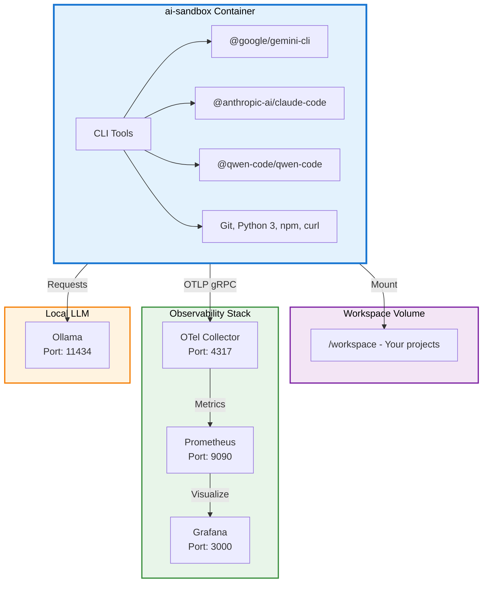

# Developer Guide - AI Sandbox

This detailed guide covers the architecture, advanced configuration, and use cases for ai-docker.

## MCP Configuration (Model Context Protocol)

The Model Context Protocol (MCP) extends Claude's capabilities with external tools like GitHub.

### GitHub Configuration for Claude

**Official documentation**: See the [official installation guide](https://github.com/github/github-mcp-server/blob/main/docs/installation-guides/install-claude.md) for more details, including creating a [GitHub Token](https://github.com/github/github-mcp-server/blob/main/docs/installation-guides/install-claude.md#creating-a-github-token).

1. **Create the AI CLI data folder** (first time only):
   ```bash
   mkdir -p ai-cli-data
   ```

2. **Launch the environment**:
   ```bash
   docker-compose up -d
   docker exec -it ai-sandbox bash
   ```

3. **Install the GitHub MCP** (inside the container):
   ```bash
   claude mcp add --transport http github \
     "https://api.githubcopilot.com/mcp" \
     -H "Authorization: Bearer $GITHUB_TOKEN"
   ```

4. **Verification**:
   The configuration will be automatically saved in `ai-cli-data/.claude.json` and persisted between sessions.

**Security**: The `ai-cli-data` folder is automatically ignored by Git to avoid pushing secrets.

### Per-project Configuration

The GitHub MCP is configured by default for the `/workspace` root folder. If you launch Claude from another folder within `workspace` (e.g., `/workspace/projects/my-project`), you need to manually add the configuration to the `.claude.json` file.

1. **Open the file** `ai-cli-data/.claude.json`
2. **Add a section** in `"projects"` by copying the `/workspace` configuration and replacing the path:

   ```json
   "/workspace/projects/my-project": {
     "allowedTools": [],
     "mcpContextUris": [],
     "mcpServers": {
       "github": {
         "type": "http",
         "url": "https://api.githubcopilot.com/mcp",
         "headers": {
           "Authorization": "Bearer $GITHUB_TOKEN"
         }
       }
     },
     "enabledMcpjsonServers": [],
     "disabledMcpjsonServers": [],
     "hasTrustDialogAccepted": false,
     "projectOnboardingSeenCount": 0,
     "hasClaudeMdExternalIncludesApproved": false,
     "hasClaudeMdExternalIncludesWarningShown": false
   }
   ```

3. **Replace** `$GITHUB_TOKEN` with your actual GitHub token.

**Tip**: The `GITHUB_TOKEN` is stored in the `.env` file in the `AI_SECRETS_BASE` folder.

**Note**: Repeat this step for each new project where you want to use the GitHub MCP.

### Context7 Configuration for Claude

**Official configuration**: Context7 is available via HTTP and requires an API key for authentication.

1. **Launch the environment** (if not already running):
   ```bash
   docker-compose up -d
   docker exec -it ai-sandbox bash
   ```

2. **Install the Context7 MCP** (inside the container):
   ```bash
   claude mcp add --transport http context7 \
     "https://mcp.context7.com/mcp" \
     --header "CONTEXT7_API_KEY: ${CONTEXT7_TOKEN}"
   ```

3. **Verification**:
   The configuration will be automatically saved in `ai-cli-data/.claude.json` and persisted between sessions.

**Tip**: The `CONTEXT7_TOKEN` is stored in the `.env` file in the `AI_SECRETS_BASE` folder. Make sure to load this file before running the commands:
   ```bash
   source /path/to/AI_SECRETS_BASE/.env
   ```

**Security**: Make sure the `CONTEXT7_TOKEN` environment variable is set before running the command.

### Context7 Configuration for Gemini

Gemini uses a `settings.json` file for its MCP configuration. Create or modify the Gemini configuration file:

1. **Create the Gemini configuration folder** (if needed):
   ```bash
   mkdir -p ~/.gemini
   ```

2. **Add the Context7 configuration** in `~/.gemini/settings.json`:
   ```json
   {
     "mcpServers": {
       "context7": {
         "httpUrl": "https://mcp.context7.com/mcp",
         "headers": {
           "CONTEXT7_API_KEY": "$CONTEXT7_TOKEN",
           "Accept": "application/json, text/event-stream"
         }
       }
     }
   }
   ```

   An example copy of this configuration is available in [gemini/settings.json](gemini/settings.json).

3. **Per-project configuration**:
   For per-project configuration, create a `.gemini/settings.json` file in the project directory with the same structure.

**Tip**: The `CONTEXT7_TOKEN` is stored in the `.env` file in the `AI_SECRETS_BASE` folder. Make sure to load this file before launching Gemini:
   ```bash
   source /path/to/AI_SECRETS_BASE/.env
   ```

**Security**: Make sure the `CONTEXT7_TOKEN` environment variable is set in your shell before launching Gemini.

## Observability in Detail

The full observability stack is pre-configured:

### OpenTelemetry Collector
- **Port**: 4317 (OTLP gRPC)
- **Role**: Centralized metrics and traces collection
- **Configuration**: [observability/otel-collector-config.yaml](observability/otel-collector-config.yaml)
- Exports metrics to Prometheus on port `9464`

### Prometheus
- **Port**: 9090
- **Role**: Metrics storage and querying
- **Scrape interval**: 15s
- **Configuration**: [observability/prometheus.yml](observability/prometheus.yml)
- Access: http://localhost:9090

### Grafana
- **Port**: 3000
- **Role**: Metrics visualization and dashboards
- **Default credentials**: admin / admin (change in production)
- Persistent volume: `grafana-data:/var/lib/grafana`

### Gemini Telemetry

Gemini telemetry is currently **disabled by default** but can be enabled by editing `docker-compose.yml`:

```yaml
environment:
  - GEMINI_TELEMETRY_ENABLED=true
  - GEMINI_TELEMETRY_TARGET=local
  - GEMINI_TELEMETRY_USE_COLLECTOR=true
  - GEMINI_TELEMETRY_OTLP_ENDPOINT=http://otel-collector:4317
```

### Testing Telemetry

To verify the observability stack is working correctly and telemetry is being collected:

1. **Enable telemetry** in `docker-compose.yml` (if not already done):
   ```yaml
   environment:
     - GEMINI_TELEMETRY_ENABLED=true
     - GEMINI_TELEMETRY_TARGET=local
     - GEMINI_TELEMETRY_USE_COLLECTOR=true
     - GEMINI_TELEMETRY_OTLP_ENDPOINT=http://otel-collector:4317
   ```

2. **Restart the services**:
   ```bash
   docker-compose down
   docker-compose up -d
   ```

3. **Open a shell in the `ai-sandbox` container**:
   ```bash
   docker exec -it ai-sandbox bash
   cd /workspace
   ```

4. **Make a test call with Gemini**:
   ```bash
   gemini "Make a test call to verify telemetry"
   ```

5. **Verify the collector is receiving data**:
   ```bash
   docker logs otel-collector --tail=50
   ```

   You should see logs indicating metrics were received, for example:
   ```
   2025-12-23T10:15:30.123Z INFO otelcol/processor/batchprocessor@v0.100.0/processor.go:245 Received 5 metrics
   ```

6. **Check Prometheus** (http://localhost:9090) to see collected metrics.

7. **Check Grafana** (http://localhost:3000) to visualize the metrics.

**Note**: If you don't see metrics, verify that telemetry is enabled and the OTLP endpoint is correct.

## Detailed Architecture



## Detailed Configuration

### Environment Variables

In `docker-compose.yml`, you can configure:

| Variable | Description | Example |
|----------|-------------|---------|
| `OLLAMA_HOST` | Ollama server URL | `http://ollama:11434` |
| `GEMINI_TELEMETRY_ENABLED` | Enable Gemini telemetry | `true/false` |
| `GEMINI_TELEMETRY_TARGET` | Gemini telemetry target | `local` |
| `GEMINI_TELEMETRY_OTLP_ENDPOINT` | OpenTelemetry endpoint | `http://otel-collector:4317` |

### Volumes and Persistence

| Volume | Mount Point | Description |
|--------|-------------|-------------|
| `ollama` | `/root/.ollama` | Ollama model cache |
| `grafana-data` | `/var/lib/grafana` | Persistent Grafana data |
| `workspace` (bind) | `/workspace` | Your projects and data |

### Exposed Ports

| Service | Port | Access |
|---------|------|--------|
| Grafana | 3000 | http://localhost:3000 |
| Prometheus | 9090 | http://localhost:9090 |
| Ollama | 11434 | http://localhost:11434 |
| OTel Collector gRPC | 4317 | Internal |
| OTel Metrics | 9464 | Internal |

## Advanced Use Cases

### Experimenting with Gemini

```bash
docker exec -it ai-sandbox bash
gemini --help
# Authentication and usage
```

### Experimenting with Claude

```bash
docker exec -it ai-sandbox bash
claude-code --help
# Using Claude tools
```

### Experimenting with Qwen

```bash
docker exec -it ai-sandbox bash
qwen-code --help
# Using Qwen tools
```

### Monitoring Your Experiments

1. **Enable telemetry** in docker-compose.yml
2. **Access Grafana**: http://localhost:3000
3. **Configure Prometheus** as datasource (http://otel-collector:9464)
4. **Create custom dashboards**

### Using Ollama for Local Models

```bash
# From the ai-sandbox container
docker exec -it ai-sandbox bash

# List available models
curl http://ollama:11434/api/tags

# Use a model (example: mistral)
ollama run mistral
```

## Security

- **Non-root user**: The image uses an `aiuser` user for security
- **Ignored secrets**: The `secrets/` and `ai-cli-data/` folders are ignored by Git
- **Dedicated volumes**: Sensitive data is stored in volumes, not in the code
- **Credentials**: Grafana uses default credentials in dev (secure in production)

## Troubleshooting

### Services won't start

```bash
# Check container status
docker-compose ps

# View the logs
docker-compose logs -f

# Restart the services
docker-compose restart
```

### Volumes not mounting correctly (Colima)

```bash
# Restart Colima
colima stop
colima start

# Restart containers
docker-compose restart
```

### Not enough resources (Colima)

```bash
# Edit the configuration
colima edit

# Increase cpu, memory, disk
# Example:
# cpu: 4
# memory: 8
# disk: 100

# Apply the changes
colima restart
```

### Grafana connection fails

```bash
# Verify the container is running
docker-compose ps grafana

# Check the logs
docker-compose logs grafana

# Reset Grafana data
docker-compose down
docker volume rm ai-docker_grafana-data
docker-compose up -d
```

## Configuration Files

### Dockerfile

Defines the `ai-sandbox` image with:
- Node.js 20
- Gemini, Claude, Qwen CLIs
- Python 3, Git, curl
- Non-root user for security

**Important**: If you modify the `Dockerfile`, you must rebuild the Docker image before restarting containers:
```bash
docker build -t ai-sandbox .
docker-compose down
docker-compose up -d
```

### docker-compose.yml

Orchestrates the services:
- `ai-sandbox`: Main container
- `ollama`: Local LLMs
- `otel-collector`: Metrics collection
- `prometheus`: Metrics storage
- `grafana`: Visualization

### observability/otel-collector-config.yaml

OpenTelemetry collector configuration:
- OTLP gRPC receiver on port 4317
- Prometheus exporter on port 9464
- Metrics pipeline

### observability/prometheus.yml

Prometheus configuration:
- Scrape interval: 15 seconds
- OpenTelemetry collector scraping

## External Resources

- [Docker Documentation](https://docs.docker.com/)
- [OpenTelemetry](https://opentelemetry.io/)
- [Grafana](https://grafana.com/grafana/)
- [Prometheus](https://prometheus.io/)
- [Ollama](https://ollama.ai/)
- [Google Gemini CLI](https://github.com/google/gemini-cli)
- [Anthropic Claude](https://www.anthropic.com/)
- [Alibaba Qwen](https://qwenlm.github.io/)

---

**Need help?** See the [README](README.md) for quick setup or [CONTRIBUTING](CONTRIBUTING.md) to contribute to the project.
