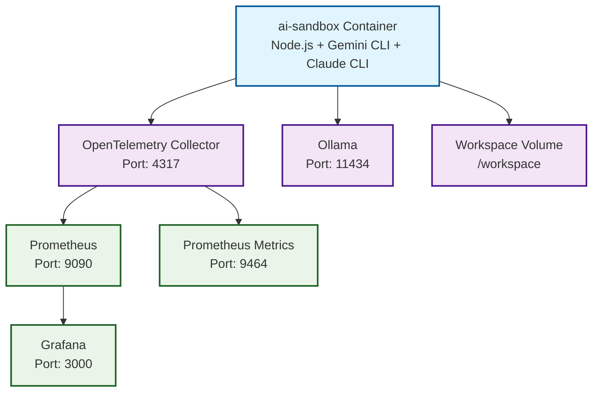

# AI Docker Sandbox

Une sandbox Docker complète pour les développeurs qui souhaitent explorer et expérimenter avec les outils IA modernes : **Gemini**, **Claude** et **Qwen**.

## 🎯 Objectif

Ce repository fournit un environnement de développement isolé, pré-configuré et reproductible pour :
- Expérimenter avec les APIs et CLIs de Google Gemini, Anthropic Claude et Alibaba Qwen
- Développer des applications IA sans poluer votre machine locale
- Tester des configurations complexes et des intégrations
- Bénéficier d'une observabilité complète de vos expériences

## 📋 Contenu

### Services principaux

- **ai-sandbox** : Conteneur principal Node.js 20 avec les CLIs Gemini et Claude pré-installés
- **Ollama** : Support des modèles LLM locaux (si besoin de modèles open-source)
- **OpenTelemetry Collector** : Collecte centralisée des métriques et traces
- **Prometheus** : Stockage et requêtes des métriques
- **Grafana** : Visualisation et dashboards des métriques

### Outils installés dans ai-sandbox

```dockerfile
- Node.js 20
- @google/gemini-cli (CLI Gemini)
- @anthropic-ai/claude-code (CLI Claude)
- @qwen-code/qwen-code (CLI Qwen)
- Git
- Python 3 + pip
- curl
```

## 🚀 Démarrage rapide

### Prérequis

- **Docker et Docker Compose** installés
- Clés API pour Gemini et/ou Claude configurées

#### Option 1 : Docker Desktop (Recommandé)

- **macOS** : https://www.docker.com/products/docker-desktop
- **Linux** : https://docs.docker.com/engine/install/
- **Windows** : https://www.docker.com/products/docker-desktop (avec WSL 2)

#### Option 2 : Colima (Alternative Open Source)

Si vous ne pouvez pas installer Docker Desktop, **Colima** est une excellente alternative légère et open-source.

**macOS - Installation via Homebrew**

```bash
# Installation
brew install colima docker docker-compose

# Démarrer Colima
colima start

# Vérifier que Docker fonctionne
docker ps
```

**Linux - Installation (Ubuntu/Debian)**

```bash
# Installer les dépendances
sudo apt-get update
sudo apt-get install -y docker.io docker-compose

# Pour Colima sur Linux, utiliser la version Go
curl -LO https://github.com/abiosoft/colima/releases/latest/download/colima-Linux-x86_64
chmod +x colima-Linux-x86_64
sudo mv colima-Linux-x86_64 /usr/local/bin/colima

# Démarrer Colima
colima start
```

**Linux - Avec package manager (Arch Linux)**

```bash
sudo pacman -S colima docker docker-compose
colima start
```

**Avantages de Colima**
- ✅ Open Source et gratuit
- ✅ Léger (utilise QEMU ou Hypervisor natif)
- ✅ Compatible avec Docker CLI standard
- ✅ Peu de ressources système
- ✅ Idéal pour les développeurs sans Docker Desktop

**Vérification de l'installation**

```bash
# Vérifier Docker
docker --version

# Vérifier Docker Compose
docker-compose --version

# Vérifier Colima (optionnel)
colima status
```

### Lancer l'environnement

#### 0️⃣ Configurer les secrets (première fois uniquement)

Créez un dossier `secrets` et un fichier `.env` pour stocker vos clés API de manière sécurisée :

```bash
# Créer le dossier secrets
mkdir -p secrets

# Créer le fichier .env avec vos clés API
cat > secrets/.env << EOF
# Clés API pour les outils IA
GITHUB_TOKEN=votre_token_github_ici
EOF
```

**🔒 Sécurité** : Le dossier `secrets/` est automatiquement ignoré par Git. Ne partagez jamais ce fichier.

#### 1️⃣ Créer le dossier workspace (première fois uniquement)

Avant de lancer les services, créez un dossier `workspace` à la racine du projet. C'est là que vous mettrez tous vos projets IA :

```bash
# Depuis la racine du projet
mkdir -p workspace
```

Ce dossier sera automatiquement monté en volume dans le conteneur `ai-sandbox` sur `/workspace`. Vous pourrez y accéder et y créer vos projets.

#### 2️⃣ Construire l'image (première fois uniquement)

La première fois que vous lancez l'environnement, vous devez construire l'image Docker `ai-sandbox` :

```bash
docker build -t ai-sandbox .
```

Cette étape n'est nécessaire que lors de la première utilisation ou après des modifications du Dockerfile.

#### 3️⃣ Lancer les services

```bash
docker-compose up -d
```

Cela démarre tous les services. Pour entrer dans le conteneur ai-sandbox :

```bash
docker exec -it ai-sandbox bash
```

### Alias pratique (Optionnel)

Pour simplifier l'accès au conteneur, créez un alias `ai-sandbox` qui lance l'environnement et entre dans le conteneur en une seule commande.

#### Pour Bash

Ajoutez cette ligne à votre fichier `~/.bashrc` :

```bash
alias ai-sandbox='cd ~/Documents/ai-docker && docker-compose up -d && docker exec -it ai-sandbox bash'
```

Puis rechargez la configuration :

```bash
source ~/.bashrc
```

#### Pour Zsh

Ajoutez cette ligne à votre fichier `~/.zshrc` :

```bash
alias ai-sandbox='cd ~/Documents/ai-docker && docker-compose up -d && docker exec -it ai-sandbox bash'
```

Puis rechargez la configuration :

```bash
source ~/.zshrc
```

#### Utilisation

Ensuite, il vous suffit de taper :

```bash
ai-sandbox
```

Et vous serez automatiquement :
1. ✅ Dans le bon répertoire du projet
2. ✅ Tous les services (Ollama, Prometheus, Grafana, etc.) seront lancés
3. ✅ Connecté au conteneur ai-sandbox

**💡 Astuce** : Adaptez le chemin `~/Documents/Projects/ai-docker` à votre propre chemin d'installation si différent.

## 🔧 Configuration MCP (Model Context Protocol)

Le Model Context Protocol (MCP) permet d'étendre les capacités de Claude avec des outils externes comme GitHub.

### Configuration GitHub pour Claude

**📖 Documentation officielle** : Consultez le [guide d'installation officiel](https://github.com/github/github-mcp-server/blob/main/docs/installation-guides/install-claude.md) pour plus de détails, incluant la création d'un [GitHub Token](https://github.com/github/github-mcp-server/blob/main/docs/installation-guides/install-claude.md#creating-a-github-token).

1. **Créer le dossier de données Claude** (première fois uniquement) :
   ```bash
   mkdir -p claude-code-data
   ```

2. **Lancer l'environnement** :
   ```bash
   docker-compose up -d
   docker exec -it ai-sandbox bash
   ```

3. **Installer le MCP GitHub** (dans le conteneur) :
   ```bash
   claude mcp add --transport http github \
     "https://api.githubcopilot.com/mcp" \
     -H "Authorization: Bearer $GITHUB_TOKEN"
   ```


4. **Vérification** :
   La configuration sera automatiquement sauvegardée dans `claude-code-data/.claude.json` et persistée entre les sessions.

**🔒 Sécurité** : Le dossier `claude-code-data` est automatiquement ignoré par Git pour éviter de pousser des secrets.

### Configuration par projet

Le MCP GitHub est configuré par défaut pour le dossier racine `/workspace`. Si vous lancez Claude depuis un autre dossier dans `workspace` (par exemple `/workspace/projects/mon-projet`), vous devez ajouter manuellement la configuration dans le fichier `.claude.json`.

1. **Ouvrez le fichier** `claude-code-data/.claude.json`
2. **Ajoutez une section** dans `"projects"` en copiant la configuration de `/workspace` et en remplaçant le chemin :

   ```json
   "/workspace/projects/mon-projet": {
     "allowedTools": [],
     "mcpContextUris": [],
     "mcpServers": {
       "github": {
         "type": "http",
         "url": "https://api.githubcopilot.com/mcp",
         "headers": {
           "Authorization": "Bearer $GITHUB_TOKEN"
         }
       }
     },
     "enabledMcpjsonServers": [],
     "disabledMcpjsonServers": [],
     "hasTrustDialogAccepted": false,
     "projectOnboardingSeenCount": 0,
     "hasClaudeMdExternalIncludesApproved": false,
     "hasClaudeMdExternalIncludesWarningShown": false
   }
   ```

3. **Remplacez** `$GITHUB_TOKEN` par votre token GitHub réel.

**💡 Note** : Répétez cette étape pour chaque nouveau projet où vous souhaitez utiliser le MCP GitHub.

### Accéder aux interfaces

- **Grafana** : http://localhost:3000
- **Prometheus** : http://localhost:9090
- **Ollama** (si utilisé) : http://localhost:11434

## 📊 Observabilité

La stack complète d'observabilité est pré-configurée :

### OpenTelemetry Collector
- Reçoit les métriques en OTLP gRPC sur le port `4317`
- Exporte les métriques vers Prometheus sur le port `9464`
- Configuration : [observability/otel-collector-config.yaml](observability/otel-collector-config.yaml)

### Prometheus
- Scrape les métriques du collector tous les 15s
- Configuration : [observability/prometheus.yml](observability/prometheus.yml)
- Accès : http://localhost:9090

### Grafana
- Visualisation des métriques Prometheus
- Port : 3000
- Credentials par défaut : admin / admin (à changer en production)

### Telemetrie Gemini

La telemetrie Gemini est actuellement **désactivée par défaut** mais peut être activée en éditant `docker-compose.yml` :

```yaml
environment:
  - GEMINI_TELEMETRY_ENABLED=true
  - GEMINI_TELEMETRY_TARGET=local
  - GEMINI_TELEMETRY_USE_COLLECTOR=true
  - GEMINI_TELEMETRY_OTLP_ENDPOINT=http://otel-collector:4317
```

## 🔧 Architecture



## 📁 Structure du projet

```
.
├── docker-compose.yml          # Orchestration des services
├── Dockerfile                   # Image custom ai-sandbox
├── observability/
│   ├── otel-collector-config.yaml
│   └── prometheus.yml
├── workspace/                   # Dossier partagé (vos projets IA)
└── README.md
```

## 🛠️ Configuration

### Variables d'environnement

Vous pouvez configurer dans `docker-compose.yml` :

- `OLLAMA_HOST` : URL du serveur Ollama
- `GEMINI_TELEMETRY_ENABLED` : Active la telemetrie Gemini
- `GEMINI_TELEMETRY_OTLP_ENDPOINT` : Point d'entrée OpenTelemetry

### Volumes

- `ollama:/root/.ollama` : Cache des modèles Ollama
- `grafana-data:/var/lib/grafana` : Données Grafana
- `~/Documents/Projects/ai-docker/workspace:/workspace` : Vos projets (à adapter à votre machine)

## 📚 Cas d'usage

### Expérimenter avec Gemini

```bash
docker exec -it ai-sandbox bash
gemini --help
# Authentification et utilisation
```

### Expérimenter avec Claude

```bash
docker exec -it ai-sandbox bash
claude-code --help
# Utilisation des outils Claude
```
Expérimenter avec Qwen

```bash
docker exec -it ai-sandbox bash
qwen-code --help
# Utilisation des outils Qwen
```

### 
### Monitorer vos expériences

1. Activer la telemetrie dans docker-compose.yml
2. Accéder à Grafana (http://localhost:3000)
3. Configurer Prometheus comme datasource (http://otel-collector:9464)
4. Créer des dashboards personnalisés

## 🧪 Développement

Pour contribuer à ce projet, consulte [CONTRIBUTING.md](CONTRIBUTING.md).

## 📝 Notes

- L'image ai-sandbox utilise un utilisateur non-root (`aiuser`) pour des raisons de sécurité
- Les CLIs sont installés globalement via npm
- La workspace est montée en volume pour la persistance
- Grafana utilise les credentials par défaut en dev (à sécuriser en production)

## 📄 Licence

[À définir selon vos préférences]

---

**Prêt à explorer l'IA ?** 🚀 Commence par lancer `docker-compose up` !
